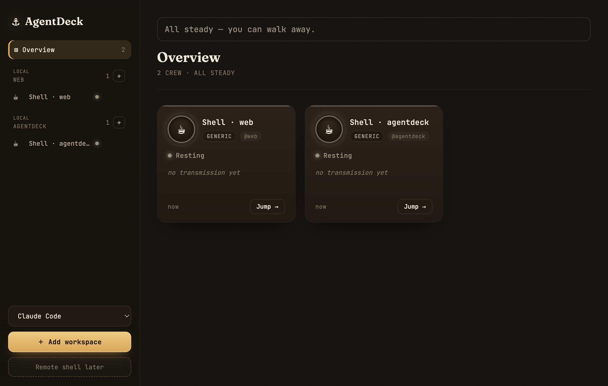

# AgentDeck

One deck for every coding agent.

If your day has turned into five terminal windows, a few agent CLIs, and constant context switching just to see who finished, who got stuck, and who is asking for approval, AgentDeck is for that moment. It gives you one quiet bridge for your agent crew: start work, walk away, and come back when something actually needs judgment.

Remote attach is not ready yet, but the product direction is the same pain: stop bouncing between local windows, tmux panes, and SSH boxes just to poll whether an agent needs you.

> **Status:** early alpha. macOS-first. Local sessions only for now; remote hosts are on the roadmap. Run from source today. A packaged macOS release is planned, but there is no `.dmg` yet.



The screenshot is a temporary product capture. A polished promotional image will replace it later.

## What AgentDeck Does

- **One deck for many agents**: Claude Code, Codex, opencode, and plain shell sessions appear in the same workspace-aware dashboard.
- **Needs-you triage**: completed turns, approvals, questions, and blocked sessions rise to the top so you do not have to babysit every terminal.
- **Unread attention badges**: the macOS tray and Dock badge show attention you have not looked at yet. Opening a session can clear the badge without erasing the session's `Needs you` state.
- **Embedded terminals**: open a session inline and continue typing without hunting for the original terminal window.
- **Liveness checks**: missing tmux sessions are removed, and quiet long-running sessions can be marked as stale.
- **Workspace grouping**: sessions from the same repo stay together, so a multi-agent workflow is easier to scan.

## Current Limits

- macOS is the primary target.
- Sessions run locally in a private tmux socket (`tmux -L deck`).
- Remote host UI is present as a direction, but remote agent mode is not ready.
- The desktop app runs from source through the repo's Electron dependency.
- No signed `.dmg`, notarization, auto-update, or installer flow yet.

## How It Works

AgentDeck is an external observer, not a replacement agent runtime.

- A Bun hub stores session state and serves HTTP/SSE.
- Agent sessions run in tmux, so they survive the UI.
- Claude Code and Codex hooks map native events into a shared state machine.
- Terminal-output heuristics provide a fallback signal for generic shells.
- React renders the dashboard.
- Electron adds the macOS app shell, tray/Dock badges, native notifications, and embedded terminals through `node-pty`.

The state model is intentionally small:

- `Working`: the user sent work and the session is active.
- `Needs you`: the agent reached a handoff, completion, approval, or question.
- `Resting`: no active handoff.
- `Error`: something failed.

## Requirements

- macOS
- [Bun](https://bun.sh)
- tmux 3.x
- Optional agent CLIs: Claude Code, Codex, opencode

## Quickstart

```bash
git clone https://github.com/ShenAC-SAC/agentdeck.git
cd agentdeck
bun install
```

Launch the desktop app:

```bash
bun run app
```

Or run the CLI/TUI:

```bash
bun run deck
```

Useful commands while the hub is running:

```bash
bun run deck new claude-code
bun run deck new codex
bun run deck new opencode
bun run deck new generic
bun run deck ls
```

## Development

```bash
bun test
bun run typecheck
bun run web:build
bun run app:smoke
```

Before running the full test suite, stop any running dev app that is listening on port `8799`.

## Release Plan

The first public version is a GitHub preview intended for source-based use. A real macOS release should come later, after the packaging path is verified:

- Electron packaging choice
- app signing
- notarization
- `.dmg` or zip distribution
- upgrade story

Until then, the recommended install path is `git clone` + `bun install` + `bun run app`.

## Roadmap

- Remote hosts over SSH.
- Packaged macOS app.
- Durable run history and session archive.
- Resume support for agent CLIs that expose it.
- Cross-agent collision signals, such as two agents touching the same files.
- Better stuck/looping detection.

## License

[MIT](LICENSE) © 2026 AochenShen99
